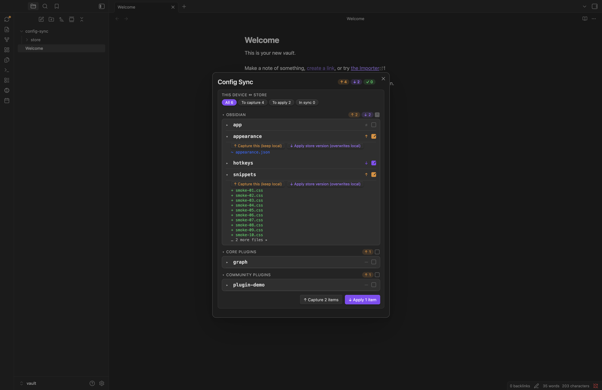

# Config Sync

[](https://github.com/xooooooooox/obsidian-config-sync/releases/latest)
[](https://obsidian.md/plugins?id=config-sync)

[](./README.md) [](./README.zh.md)

Selective, on-demand sync of Obsidian settings — hotkeys, CSS snippets, themes, plugin configs — across devices and vaults. The data rides your existing note sync (remotely-save, Obsidian Sync, iCloud…) by default, or config-sync's own git / vault remotes. Nothing ever lands on a device without an explicit **Apply** from the Sync Center.


## Features

- **Pick exactly what syncs** — Obsidian options, core-plugin and community-plugin settings, snippets, themes, vault-root dotfiles; per item, per device class (all / desktop / mobile).
- **Credential-safe** — per-item sync modes strip or encrypt sensitive keys before anything enters the store; each device keeps its locally entered values across applies.
- **Explicit, reversible Apply** — pick items, land them directly (no confirmation dialog); every touched file is backed up and **Revert last apply** restores it.
- **Removable and tidy** — stop syncing an item at any time (optionally deleting its store copy), and store files left behind with no matching item surface as **Leftover** for one-click cleanup.
- **Always-visible awareness** — a ribbon status dot lights up orange (items to capture) or blue (store/remote updates); open the **Sync Center** for the details. Its header is a single status bar: a *this device* chip (a green check when everything is in sync, otherwise the current state and a shortcut into settings) followed by the totals for every pending action, including per-remote push/pull counts. Every item is badged by state (`✓ in sync`, changed-on-this-device, store-is-newer, `≠ differs`, `— not captured yet`), each sync action (Capture, Apply, Push, Pull) has its own icon, and remotes are checked automatically.
- **Availability-aware** — plugins that are outdated, disabled, or not installed on this device get their own collapsed sections with a plugin-install/update engine, so applying can also update, enable or install a community plugin in the same step. A **Beta** tab tracks community plugins installed through BRAT, so their configs sync like any other.
- **Remote-aware** — the Sync Center's Remotes block auto-checks whether a git or vault remote was captured after your local store; expand a remote for a Pull/Push preview.
- **Fast filtering & search** — both search boxes accept `key:value` qualifiers with autocomplete: in the Sync Center `type:`/`scope:`/`action:`/`mode:`/`device:`, in settings `scope:`/`type:` — combined freely with plain text.
- **Mobile-friendly** — capture, apply and the Sync Center all work on phones; the store is plain vault content, so any note sync carries it.

## Install

From Obsidian: **Settings → Community plugins → Browse**, search **Config Sync**, install and enable.

Beta builds: via [BRAT](https://github.com/TfTHacker/obsidian42-brat), add `xooooooooox/obsidian-config-sync`.

## Quick start

1. **Settings → Config Sync** — tick what you want to sync (Obsidian / Core plugins / Community plugins tabs).
2. Open **Sync** from the ribbon menu (or the **Sync: open the sync panel** command) to open (or focus, if already open) the Sync Center, tick what to capture, and press **Capture N items**.
3. On another device, once your note sync has delivered the data folder: open **Sync**, tick what to apply, and press **Apply N items**.

## How it works

Two planes, kept separate.

**Local plane** — this device's live config ↔ the store:

- **Capture** copies the items defined in `<data folder>/config-sync.json` into `<data folder>/store/`, applies each item's sync mode (stripping or encrypting fields, or encrypting the whole file), skips OS junk files, and records source plugin versions (or the Obsidian app version, for Obsidian/core items) in `store.lock.json`. Only changed files are rewritten; the Sync Center's Capture button captures just what you've ticked.
- **Apply** picks items and lands them into this device's config dir (whatever its name) — there's no confirmation dialog; ticking and pressing Apply executes directly. For a community plugin that's outdated, disabled or not installed on this device, Apply can also update, enable or install it first (see below). Stripped fields and encrypted content resolve per the item's sync mode; stripped keys keep their local values. A one-slot backup covers every touched file; **Revert last apply** restores it.
- The **Sync Center** compares live config against the store per item, with best-effort direction hints (file times vs the last capture) and automatic remote freshness checks.

### Availability sections and the install engine

Beyond the main list, the Sync Center groups community/core plugin items by what's true on *this* device, in collapsed, opt-in sections that never count into the header pills, sidebar badges, filter pills or footer until you tick something inside them:

- **Outdated on this device** — enabled plugins whose installed version is behind what the store was captured on.
- **Disabled on this device** — plugins whose config is tracked but the plugin itself is switched off here.
- **Not installed on this device** — plugins the store has config for but that aren't installed here at all.

Each row in these sections carries an **On apply** choice alongside the usual checkbox — the checkbox decides whether the item's config is part of this run, the On apply choice decides what happens to the plugin's state before that config lands:

- Outdated: `⤓ Update to latest` (default) or `Keep {version}`.
- Disabled, no version drift: `⏻ Enable` (default) or `Keep disabled`.
- Disabled and outdated: `⤓ Update & enable` (default), `⏻ Enable`, or `Keep disabled`.
- Not installed: `⤓ Install & enable` (default), `⤓ Install`, or `Stage only`.

Installs and updates fetch the plugin from the official community plugin catalog, **pinned to the version the store was captured on** (recorded in `store.lock.json`) so every device converges on the same version; when that exact release is missing it falls back to the latest stable with a warning. A plugin that isn't in the catalog is staged (its config is written, ready for whenever you install it manually) with a note to that effect. A failed update leaves the existing config untouched (an old version is assumed unsafe to overwrite blindly); a failed install still stages the config, since an uninstalled plugin can't be harmed by it. **A single failure never aborts a bulk install** — the offending plugin becomes one error row in the result and the rest of the batch still installs.

A plugin ahead of the store's recorded version shows a quiet metadata line instead of a section (capturing again will refresh the store). Obsidian and core-plugin items are anchored to the Obsidian app version rather than a plugin version — drift there is reminder-only in both directions and never drives an install/update action.

**Transport plane** — how the store travels:

- **Your note sync (default)**: the store is plain vault content — remotely-save, Obsidian Sync, iCloud or anything else carries it everywhere, mobile included, zero configuration. On a **fresh device**, once the store arrives, the Sync Center discovers it on its own and shows an **Adopt** banner; adopting it runs a one-time guide that walks you through applying the store to set the device up — and warns against capturing over it with the new device's empty defaults.
- **Pull / Push (desktop, optional)**: config-sync's own transport for a git repo or another vault on this machine, run from the Sync Center's Remotes block. Pull overwrites this vault's store from a remote (repeatable — cold start and ongoing use are the same action); Push sends it out. The git transport clones to a temp dir and never touches your vault's own repo.

Everything hangs off one **Config Sync** ribbon icon: a status dot shows orange when there are items to capture or blue when the store or a remote has updates. Clicking it opens a menu with **Sync…** (badged with the pending capture/apply counts) and **Revert last apply**; Sync… opens (or focuses, if already open) the Sync Center, where Capture/Apply/Pull/Push all happen. Individual ribbon icons for Sync and Revert are available under **Settings → General**, off by default. You can also add your own **Quick commands** to that menu (Settings → General) — any Obsidian command (e.g. remotely-save's *Start sync*) appears under a divider and runs on click; a command not installed on the current device is greyed out. The list is synced across your devices with the rest of Config Sync's settings. Each entry takes the command's own icon by default (change it from a searchable icon picker), and you can drop in **separators** to group them.

Capture, Apply, Pull and Push each finish by rendering a result strip **pinned to the top of the Sync Center** — a collapsible summary (changed/unchanged counts, per-item detail on demand) rather than a popup dialog, so it stays visible while you scroll a long list and doesn't interrupt further ticking. Its tone reflects the outcome — green when the run is clean, amber or red when items need attention, with failures expanded by default. Every run is also recorded in a browsable, clearable **History**: a sidebar entry opens a table of past runs (a card list on narrow/mobile screens, so it reads top-to-bottom with no horizontal scroll), each expandable to its per-item detail. **Revert last apply** is the exception and still opens a report dialog, since it's run from outside the hub (ribbon menu or command palette).

The Sync Center header is a status bar: a **this device** chip shows Config Sync's own sync state — a green check when in sync, otherwise its state plus a Settings shortcut — followed by totals for every pending action, including per-remote push/pull counts. The chip opens the **this device** pane, where Config Sync's own configuration (its item list, field rules and options) is captured and applied like any other item; when that list changes, an expandable *view change* shows the exact `data.json` delta and what capturing will publish.

The **Filter by name…** search box lives in the Sync Center's sidebar and searches globally across every scope at once (Obsidian, Core plugins, Community plugins, snippets, themes, dotfiles). Beyond plain text it accepts `key:value` qualifiers — `type:` (file/folder), `scope:` (obsidian/core/community/beta/custom), `action:` (capture/apply/ok/none), `mode:` (plain/fields/encrypted) and `device:` (all/desktop/mobile) — that narrow together and combine with free text, with an autocomplete dropdown suggesting keys then values. The sidebar shows a hit count per scope and sections with a match auto-expand to show just the hits.



## Settings guide

- **General** — PKM mode (auto-detects IOTO vaults), the data folder location, status toggles (sync menu change counts, automatic remote checks, periodic local check), ribbon icons.
- **Obsidian / Core plugins / Community plugins / Beta** — tick items to sync them; a heading toggle syncs all/none per section. The **Search all settings…** box spans General, all picker tabs, Advanced and Remotes, and accepts `scope:` (general/obsidian/core/community/advanced/remotes) and `type:` (file/folder) qualifiers with autocomplete alongside plain text. The **Beta** tab tracks community plugins installed through [BRAT](https://github.com/TfTHacker/obsidian42-brat) — grouped by enabled / installed-but-disabled / not-installed — so their configs sync like any other plugin. Items with sensitive-looking keys sort to the top of their section with a `⚠ N keys` badge, so they're visible before you enable syncing. Device-specific items (the `sync`/`publish` core plugins) carry a `device-specific` badge and ask for confirmation when enabled. **Workspaces** (deliberately saved layouts, `workspaces.json`) is a Core-plugin item; the volatile `workspace.json`/`workspace-mobile.json` are not classified into any tab — they turn up under Advanced → Discovered files like any other unrecognized config file.
- Every synced item's row has a chevron that opens an expansion: **Fields to protect** (when its mode is Fields), a read-only **View data.json** — keys are colored by rule state, and clicking one adds it as a strip/encrypt rule, covering anything the built-in sensitive-key detection misses — and **Advanced** (a store-path override and **↺ Reset this item to its default rule**).
- **Advanced** — **Custom rules** (fully yours: vault-root files, extra folders, sync modes) and **Discovered files** (config files we couldn't classify; toggle to sync — name and path are fixed by the file), each row using the same expansion. When any managed item is customized (path, fields or mode diverge from its default), a summary banner lists them with a **↺ Reset all to defaults** button.
- **Remotes** (desktop) — add a **git repository** (URL, branch, optional folder) or **another vault**: click **Browse…**, pick the vault folder, and the store inside it is auto-detected.

## Store layout

```
<data folder>/               # default "config-sync", configurable
├── config-sync.json         # group definitions (yours to edit)
├── store.lock.json          # capture metadata (machine-written)
└── store/
    ├── configdir/…          # mirror of {configDir}/… (device-independent)
    └── <dotless files>      # vault-root dotfiles, leading dot stripped
```

`config-sync.json` example:

```json
{
  "$schema": "https://raw.githubusercontent.com/xooooooooox/obsidian-config-sync/main/schema/config-sync.schema.json",
  "version": 1,
  "groups": [
    { "name": "snippets", "path": "{configDir}/snippets", "type": "dir", "devices": "all" },
    { "name": "hotkeys", "path": "{configDir}/hotkeys.json", "type": "file", "devices": "all" },
    { "name": "vimrc", "path": ".obsidian.vimrc", "type": "file", "devices": "desktop" },
    { "name": "plugin-ioto-settings", "path": "{configDir}/plugins/ioto-settings/data.json",
      "type": "file", "devices": "all", "mode": "fields",
      "fields": [
        { "pattern": "*APIKey*", "action": "encrypt" },
        { "pattern": "*Token*", "action": "encrypt" },
        { "pattern": "*Secret*", "action": "encrypt" },
        { "pattern": "userEmail", "action": "strip" }
      ] }
  ]
}
```

Group fields: `name` (unique; letters, digits, `-`/`_`, starting with a letter or digit — real plugin ids may contain uppercase, e.g. `plugin-DEVONlink-obsidian`) · `path` (`{configDir}` variable supported) · `type` (`file`/`dir`) · `devices` (`all`/`desktop`/`mobile`) · `mode` (`plain`/`fields`/`encrypted`, optional, default `plain`) · `fields` (per-key `Strip`/`Encrypt` rules, `fields` mode only — see [Sensitive settings](#sensitive-settings)) · `label` (optional display name recorded when the item is enabled or captured, so it still shows correctly on a device where the plugin isn't installed).

OS junk (`.DS_Store`, `Thumbs.db`, `desktop.ini`) is never captured. See [Sensitive settings](#sensitive-settings) for per-item sync modes and passphrase-protected encryption.

## Walkthroughs

**Sync hotkeys, appearance and CSS snippets everywhere**
1. Settings → Config Sync → under *Obsidian*, tick **Hotkeys**, **Appearance**, **CSS snippets**.
2. Open **Sync** from the ribbon menu and press **Capture N items**.
3. On each other device, once your note sync has delivered the data folder: open **Sync** and press **Apply N items**.
4. Each CSS snippet's *active on* scope (all / desktop / mobile) is per-device and can be re-scoped at any time. If enabled-snippet names linger after you rename or delete the underlying files, the settings panel surfaces them as *N enabled snippets have no file · Clean up* for one-click tidying.

**Sync a plugin's settings but keep credentials out of the store**
1. Under *Community plugins*, tick the plugin.
2. Set its mode to **Fields**, then add rules for its credential keys, e.g. `*Token*`, `*Secret*`, `*APIKey*` → `Strip` (or `Encrypt` if you want them to travel).
3. Capture. Stripped credentials never enter the store; each device keeps its locally entered values across applies.

**IOTO vault, from zero**
1. Install the plugin — PKM mode auto-detects IOTO and stores data under `0-Extra/config-sync` (from your ioto-settings aux folder).
2. Tick what you want to sync, Capture from the Sync Center, and let remotely-save carry it; other devices Apply from their own Sync Center.

**Seed a second vault from another one, without a shared note sync (desktop)**
1. In the target vault: Settings → Config Sync → **Remotes** → add a remote of type **Another vault**, click **Browse…** and pick the source vault's folder — its store is auto-detected into **Store path** (or add a git remote: URL + branch, optionally a folder in the repo).
2. Open **Sync**, expand the remote, and press **Pull from `<name>`**; then tick what to apply and press **Apply N items**.
3. Later, from the source vault, expand the remote in its own Sync Center and press **Push to `<name>`** to publish updates for the other vault to pull.

## Security & privacy

Everything the plugin does by default stays inside your vault: Capture/Apply copy files between your config folder and the data folder, and your own note sync moves them between devices. Two **optional, desktop-only** remote features go further and are disclosed here:

- **Network use (git remotes only).** If you add a git remote under Settings → Remotes, Pull/Push run the `git` binary against the URL you configured — that is the only network access the plugin ever performs. No telemetry, no other endpoints.
- **Files outside the vault (vault remotes and git temp clones).** If you add a remote of type "Another vault", Pull/Push read/write the absolute store path you configured (typically another vault's data folder). Git pushes additionally use a temporary clone directory that is removed afterwards.

Both features are disabled until you configure a remote, and never run without an explicit Pull or Push from the Sync Center.

## Sensitive settings

Every item has a sync mode, set per item in Settings:

- **Plain** (default) — synced as-is.
- **Fields** (file items only) — per-key rules: `Strip` keeps a key out of the store entirely (Apply preserves the local value); `Encrypt` stores the value as an encrypted envelope and decrypts it on Apply, so credentials can travel safely.
- **Encrypt** — the whole file is stored encrypted (AES-256-GCM, key derived from a passphrase via PBKDF2).

Encrypt modes need a vault-level **Passphrase**, set once per device in Settings → General — it's never written to any file and never synced; the same passphrase on each device is all that's needed. An item with encrypted content but no passphrase set on the current device shows a *locked* state (marked with a key icon) and won't capture or apply until the passphrase is set. A wrong passphrase on Apply fails cleanly without writing anything.

Every installed plugin is scanned for sensitive-looking keys (API keys, tokens, secrets, passwords, emails) or an opaque encrypted blob before you ever enable syncing — a `⚠ N keys` / `⚠ opaque blob` badge appears on the row and sorts it to the top of its section; this only informs, you still choose the mode. Each synced item's row expansion (via its chevron) includes a read-only **View data.json**: keys are colored by rule state (teal = encrypted, red = stripped, amber = detected but unruled), and clicking a key adds it as a strip/encrypt rule directly — the escape hatch for anything the built-in detection misses. The Sync Center badges each item with its mode — a lock icon for whole-file **Encrypt**, a fields badge (field lines with a small padlock) for **Fields**, nothing for **Plain** — and capture reports state exactly what was encrypted or stripped.

There is no hard blacklist anymore — `remotely-save`, `ioto-update`, `slides-rup` and `config-sync` are now normal items like any other (e.g. `remotely-save` can be whole-file encrypted; `ioto-update` works well with Fields).

## Development

```bash
npm install
npm run dev     # watch build
npm test        # vitest
npm run build   # type-check + production bundle
```

Develop against a dedicated test vault (never a real one).

## Releasing

1. `npm version <x.y.z>` — bumps `manifest.json` + `versions.json` (via `version-bump.mjs`), commits, and tags.
2. `git push --follow-tags`
3. The "Release Obsidian plugin" workflow builds, attests build provenance, and creates a **draft** GitHub release with `main.js`, `manifest.json`, `styles.css`.
4. Publish the draft on GitHub — the directory and BRAT only see published releases.

## License

[MIT](LICENSE)
