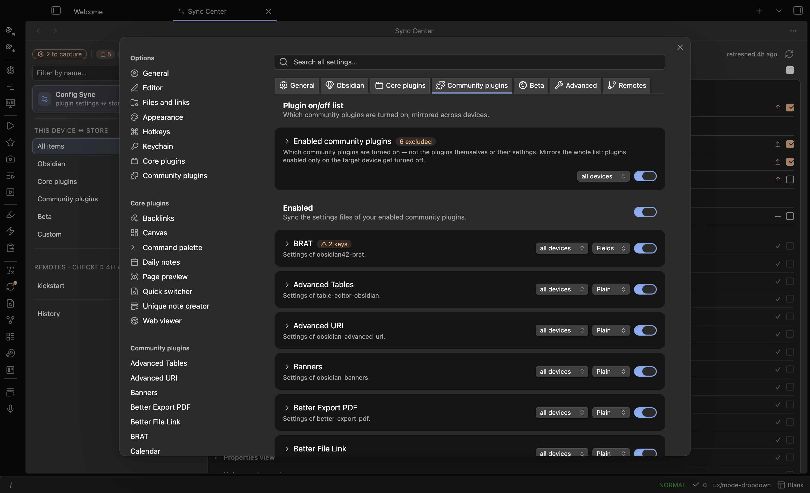
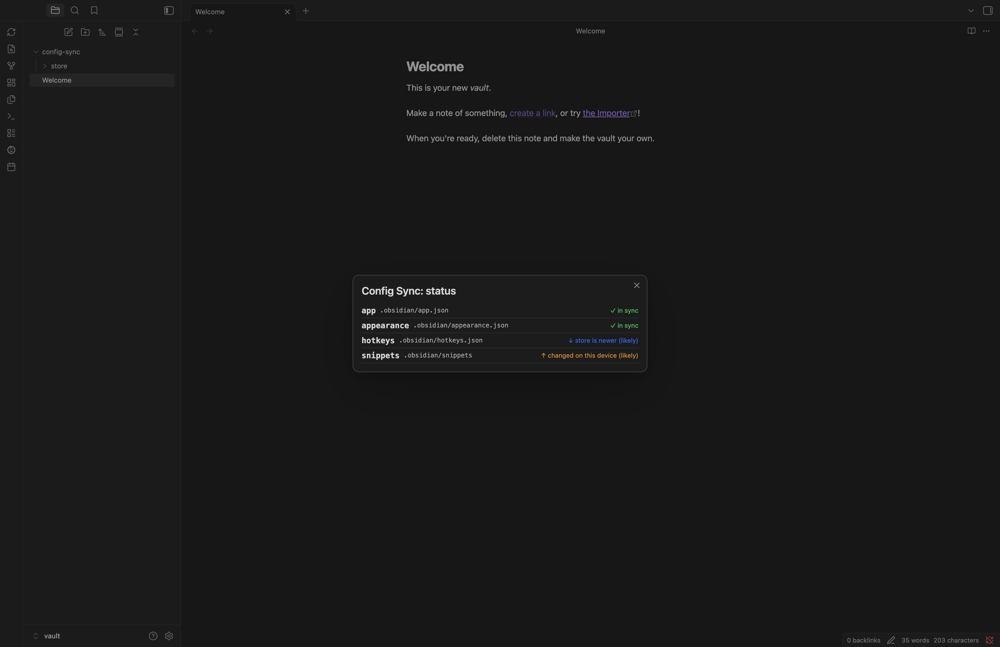
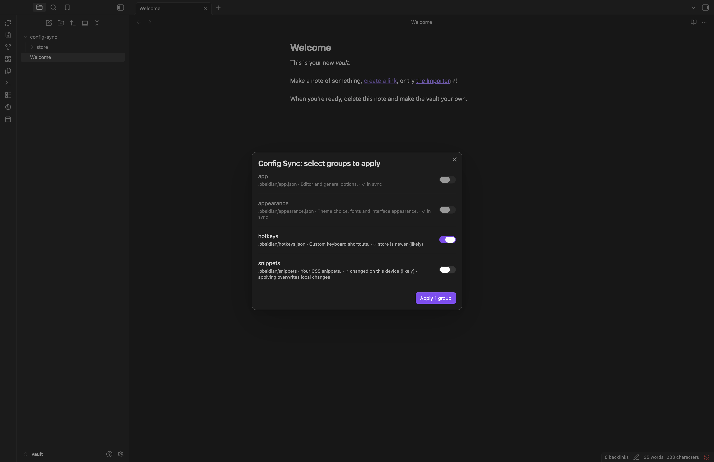

# Config Sync

[](https://github.com/xooooooooox/obsidian-config-sync/releases/latest)
[](https://obsidian.md/plugins?id=config-sync)

**English** · [中文](README.zh.md)

Selective, on-demand sync of Obsidian settings — hotkeys, CSS snippets, themes, plugin configs — across devices and vaults. The data rides your existing note sync (remotely-save, Obsidian Sync, iCloud…) by default, or config-sync's own git / vault remotes. Nothing ever lands on a device without an explicit **Apply**.



## Features

- **Pick exactly what syncs** — Obsidian options, core-plugin and community-plugin settings, snippets, themes, vault-root dotfiles; per item, per device class (all / desktop / mobile).
- **Credential-safe** — `sanitize` key globs strip tokens and secrets before anything enters the store; each device keeps its locally entered values across applies.
- **Explicit, reversible Apply** — pick groups, see version-mismatch warnings, land them; every touched file is backed up and **Revert last apply** restores it.
- **Know what's in sync** — the **Status** view badges every group (`✓ in sync`, `↑ changed on this device (likely)`, `↓ store is newer (likely)`, `≠ differs`, `— not captured yet`), the sync menu shows change counts, and the Apply picker pre-selects what the store updated.
- **Remote-aware** — check whether a git or vault remote was captured after your local store; Pull/Push on demand (desktop).
- **Mobile-friendly** — capture, apply and status all work on phones; the store is plain vault content, so any note sync carries it.

## Install

From Obsidian: **Settings → Community plugins → Browse**, search **Config Sync**, install and enable.

Beta builds: via [BRAT](https://github.com/TfTHacker/obsidian42-brat), add `xooooooooox/obsidian-config-sync`.

## Quick start

1. **Settings → Config Sync** — tick what you want to sync (Obsidian / Core plugins / Community plugins tabs).
2. Run **Capture: save this device's settings** (ribbon menu or command palette).
3. On another device, once your note sync has delivered the data folder: **Apply: update this device with synced settings**.

## How it works

Two planes, kept separate.

**Local plane** — this device's live config ↔ the store:

- **Capture** copies the groups defined in `<data folder>/config-sync.json` into `<data folder>/store/`, strips `sanitize`d keys, skips OS junk files, and records source plugin versions in `store.lock.json`.
- **Apply** picks groups, warns on plugin-version mismatches, then lands them into this device's config dir (whatever its name). Sanitized keys keep their local values. A one-slot backup covers every touched file; **Revert last apply** restores it.
- **Status** compares live config against the store per group, with best-effort direction hints (file times vs the last capture) and on-demand remote freshness checks.

**Transport plane** — how the store travels:

- **Your note sync (default)**: the store is plain vault content — remotely-save, Obsidian Sync, iCloud or anything else carries it everywhere, mobile included, zero configuration.
- **Pull / Push (desktop, optional)**: config-sync's own transport for a git repo or another vault on this machine. Pull overwrites this vault's store from a remote (repeatable — cold start and ongoing use are the same command); Push sends it out. The git transport clones to a temp dir and never touches your vault's own repo.

Everything hangs off one **Config Sync** ribbon icon that opens a menu of the currently available actions, with change counts when there's something to do (e.g. `Capture (2 changed here)`). Individual ribbon icons per command are available under **Settings → General**, off by default.



## Settings guide

- **General** — PKM mode (auto-detects IOTO vaults), the data folder location, status toggles (menu change counts, Apply-picker badges), ribbon icons.
- **Obsidian / Core plugins / Community plugins** — tick items to sync them; a heading toggle syncs all/none per section; a search box spans all tabs. `workspace.json` and the `sync`/`publish` core plugins are *Not recommended* and ask for confirmation.
- **Advanced** — every rule as a compact row; expand to edit. **Managed by pickers** (created by ticks; reset to default per row or in bulk), **Discovered files** (config files we couldn't classify; toggle to sync — name and path are fixed by the file), **Custom rules** (fully yours: vault-root files, extra folders, sanitize patterns).
- **Remotes** (desktop) — add a **git repository** (URL, branch, optional folder) or **another vault**: click **Browse…**, pick the vault folder, and the store inside it is auto-detected.



## Store layout

```
<data folder>/               # default "config-sync", configurable
├── config-sync.json         # group definitions (yours to edit)
├── store.lock.json          # capture metadata (machine-written)
└── store/
    ├── configdir/…          # mirror of {configDir}/… (device-independent)
    └── <dotless files>      # vault-root dotfiles, leading dot stripped
```

`config-sync.json` example:

```json
{
  "$schema": "https://raw.githubusercontent.com/xooooooooox/obsidian-config-sync/main/schema/config-sync.schema.json",
  "version": 1,
  "groups": [
    { "name": "snippets", "path": "{configDir}/snippets", "type": "dir", "devices": "all" },
    { "name": "hotkeys", "path": "{configDir}/hotkeys.json", "type": "file", "devices": "all" },
    { "name": "vimrc", "path": ".obsidian.vimrc", "type": "file", "devices": "desktop" },
    { "name": "plugin-ioto-settings", "path": "{configDir}/plugins/ioto-settings/data.json",
      "type": "file", "devices": "all",
      "sanitize": ["*ForSync", "*ForFetch", "*APIKey*", "*Token*", "*Secret*", "userEmail"] }
  ]
}
```

Group fields: `name` (unique) · `path` (`{configDir}` variable supported) · `type` (`file`/`dir`) · `devices` (`all`/`desktop`/`mobile`) · `sanitize` (optional key-glob list, file groups only).

Never syncable (hard blacklist): the `remotely-save`, `ioto-update`, `slides-rup`, `config-sync` and `obsidian-config-sync` plugin dirs. OS junk (`.DS_Store`, `Thumbs.db`, `desktop.ini`) is never captured.

## Walkthroughs

**Sync hotkeys, appearance and CSS snippets everywhere**
1. Settings → Config Sync → under *Obsidian*, tick **Hotkeys**, **Appearance**, **CSS snippets**.
2. Run **Capture: save this device's settings**.
3. On each other device, run **Apply: update this device with synced settings** once your note sync has delivered the data folder.

**Sync a plugin's settings but keep credentials out of the store**
1. Under *Community plugins*, tick the plugin.
2. Open *Advanced* — expand the rule the tick created and add sanitize patterns for its credential keys, e.g. `*Token*, *Secret*, *APIKey*`.
3. Capture. Credentials never enter the store; each device keeps its locally entered values across applies.

**IOTO vault, from zero**
1. Install the plugin — PKM mode auto-detects IOTO and stores data under `0-Extra/config-sync` (from your ioto-settings aux folder).
2. Tick what you want to sync, Capture, and let remotely-save carry it; other devices Apply.

**Seed a second vault from another one, without a shared note sync (desktop)**
1. In the target vault: Settings → Config Sync → **Remotes** → add a remote of type **Another vault**, click **Browse…** and pick the source vault's folder — its store is auto-detected into **Store path** (or add a git remote: URL + branch, optionally a folder in the repo).
2. Run **Pull: get settings from a remote**, then **Apply: update this device with synced settings**.
3. Later, from the source vault, **Push: send settings to a remote** publishes updates for the other vault to pull.

## Security & privacy

Everything the plugin does by default stays inside your vault: Capture/Apply copy files between your config folder and the data folder, and your own note sync moves them between devices. Two **optional, desktop-only** remote features go further and are disclosed here:

- **Network use (git remotes only).** If you add a git remote under Settings → Remotes, Pull/Push run the `git` binary against the URL you configured — that is the only network access the plugin ever performs. No telemetry, no other endpoints.
- **Files outside the vault (vault remotes and git temp clones).** If you add a remote of type "Another vault", Pull/Push read/write the absolute store path you configured (typically another vault's data folder). Git pushes additionally use a temporary clone directory that is removed afterwards.

Both features are disabled until you configure a remote, and never run without an explicit Pull or Push command.

## Development

```bash
npm install
npm run dev     # watch build
npm test        # vitest
npm run build   # type-check + production bundle
```

Develop against a dedicated test vault (never a real one).

## Releasing

1. `npm version <x.y.z>` — bumps `manifest.json` + `versions.json` (via `version-bump.mjs`), commits, and tags.
2. `git push --follow-tags`
3. The "Release Obsidian plugin" workflow builds, attests build provenance, and creates a **draft** GitHub release with `main.js`, `manifest.json`, `styles.css`.
4. Publish the draft on GitHub — the directory and BRAT only see published releases.

## License

[MIT](LICENSE)
