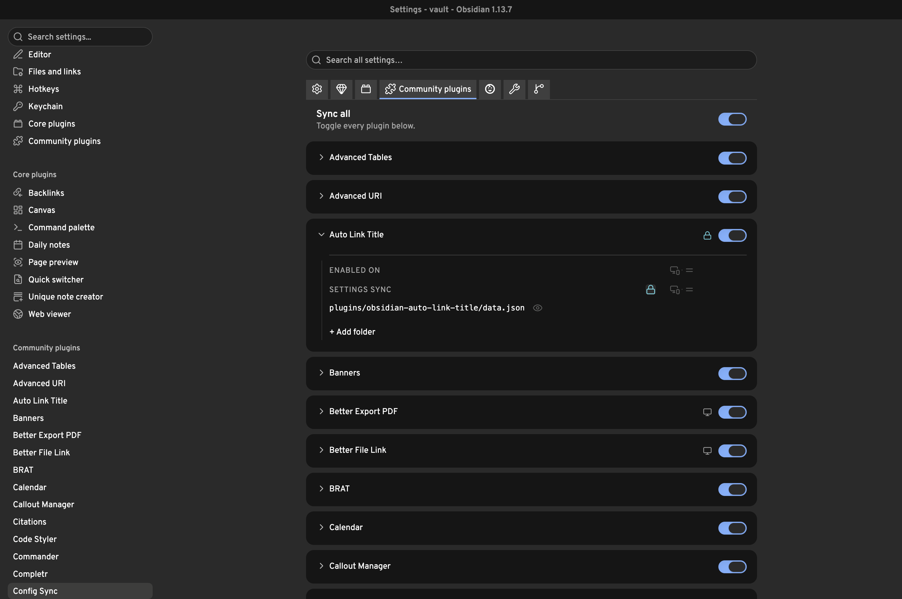
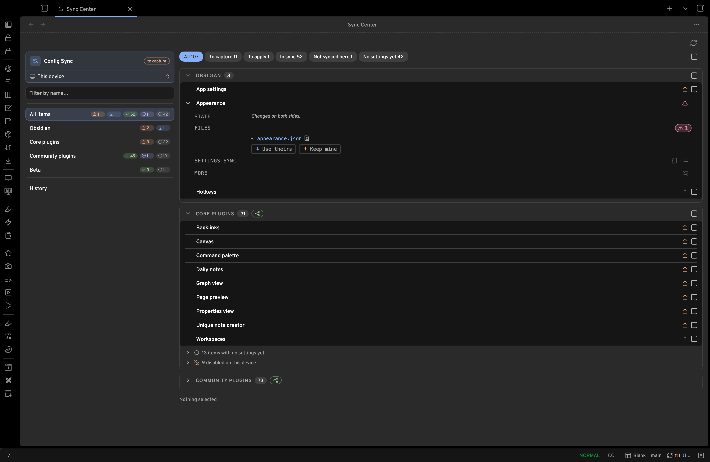

<p align="center"></p>

# Config Sync

[](https://github.com/xooooooooox/obsidian-config-sync/releases/latest)
[](https://obsidian.md/plugins?id=config-sync)

[English](README.md) · **中文**

在多台设备和多个 vault 之间，按需、选择性地同步 Obsidian 设置——快捷键、CSS 代码片段、主题、插件配置。数据默认借助你现有的笔记同步工具(note sync)（remotely-save、Obsidian Sync、iCloud……）传输，也可以使用 config-sync 自带的 git / vault 远程通道。任何设置在没有在 Sync Center 中明确执行 **Apply**(应用) 之前，绝不会落到设备上。

> **破坏性升级。** 本版本同时改变了 store 格式与设置结构（`schemaVersion: 2`），不提供从旧版本的迁移。请把所有设备一并升级到本版本，然后在每台设备上重新打开 **Settings → Config Sync**，重新勾选要同步的内容，之后再执行 capture 或 apply。



## 功能特性

- **每个条目一张卡片** —— 每个被同步的对象（一组 Obsidian 选项、一个核心/社区插件、一份代码片段）都是同一种行 + 可展开抽屉：名称、徽标、一个同步开关，展开后最多三个区域：**Enabled on**（哪些设备启用该插件）、**Settings file**（其字段规则）、**Companion folders**（主题、代码片段，或你自行添加的任意文件夹）。不再有独立的 "Enabled community plugins" / "Enabled core plugins" 行——插件的启用状态就在它自己的卡片上。
- **逐键的正交规则** —— 每条字段规则都是一个可自由组合的 `{scope, encrypted}` 二元组：`All devices`、`Desktop only`、`Mobile only` 或 `This device`，每一种都可以独立选择是否加密。整个文件也可以标记为加密，而不仅限于单个字段。字符串数组类型的键（某插件的启用元素列表、CSS 代码片段列表、`app.json` 的 `userIgnoreFilters`……）可以打开 **Per-item scopes** 开关，让每个元素拥有自己的 scope，而不是整个键共用一条规则——插件逐项启用、代码片段逐项 scope、忽略规则逐项 scope 背后都是同一套机制。
- **凭证安全** —— 逐键或整文件加密，确保敏感键永远不会以明文形式进入 store；每台设备在每次 Apply 后都会保留自己本地填入的 `This device` 值。
- **明确的 Apply** —— 挑选条目，直接落地（没有确认弹窗）；每次运行的变更都会留在贴顶结果条与 **History** 中可见。
- **可移除、可清理** —— 随时停止同步某个条目（可选一并删除其 store 副本）；store 中遗留的、没有对应条目的文件会作为 **Leftover**（遗留）浮现出来，一键清理。
- **随时可见的状态感知** —— 打开 **Sync Center** 随时查看详情；其页头本身就是一条状态栏：一个 *this device*（本设备）胶囊（全部 in sync 时显示绿色对勾，否则显示当前状态并提供进入设置的快捷入口），后面跟着每一类待办动作的总数，包括每个远程各自的 push/pull 计数。每个条目按状态打上徽标（`✓ in sync`、changed-on-this-device、store-is-newer、`≠ differs`、`— not captured yet`），每个同步动作（Capture、Apply、Push、Pull）都有各自独立的图标，远程仓库会被自动检查。
- **状态栏** —— 同步状态一目了然：↑ 待捕获、↓ 待应用，以及每个 remote 各自的 ⇡ push / ⇣ pull 计数；点击可直接打开 **Sync Center**。全部同步时只显示一个置灰图标。原有的 ribbon 图标圆点现在改为可选（默认关闭）；另有一个仅限手机端的开关，可强制显示被 Obsidian 隐藏的状态栏。
- **感知可用性** —— 落后版本、被禁用或未安装的插件会各自出现在独立的折叠分区中，配合插件安装/更新引擎，让 apply 在同一步里也能顺带更新、启用或安装某个社区插件。**Beta** 标签页会追踪通过 BRAT 安装的社区插件，让它们的配置像其他条目一样同步。
- **感知远程状态** —— Sync Center 的 Remotes 区块会自动检查 git 或 vault 远程仓库是否在你的本地 store 之后被捕获过；展开某个远程可预览 Pull/Push 的内容。
- **快速筛选与搜索** —— 两个搜索框都支持带自动补全的 `key:value` 限定符：Sync Center 中支持 `type:`/`scope:`/`action:`/`mode:`/`device:`，设置中支持 `scope:`/`type:`——可与纯文本自由组合。
- **移动端友好** —— capture、apply 以及 Sync Center 在手机上均可正常工作；store 本身就是普通的 vault 内容，因此任何笔记同步工具都能携带它。

## 安装

在 Obsidian 内：**Settings → Community plugins → Browse**，搜索 **Config Sync**，安装并启用。

体验测试版：通过 [BRAT](https://github.com/TfTHacker/obsidian42-brat)，添加 `xooooooooox/obsidian-config-sync`。

## 快速开始

1. **Settings → Config Sync** —— 勾选你想同步的内容（Obsidian / Core plugins / Community plugins 三个标签页）。
2. 从功能区菜单打开 **Sync Center**（或使用 **Sync: open the sync panel** 命令），勾选要 capture 的条目，点击 **Capture N items**。
3. 在另一台设备上，等你的笔记同步工具(note sync)把数据文件夹送达之后：打开 **Sync Center**，勾选要 apply 的条目，点击 **Apply N items**。

## 工作原理

两个层面，彼此分离。

**本地层面** —— 本设备的实时配置 ↔ store：

- **Capture**（捕获） 把每个已启用条目的设置文件和 companion 文件夹复制进 `<数据文件夹>/store/`，按每个字段的 `{scope, encrypted}` 规则处理（没有逐键规则的条目则按整文件规则处理），跳过操作系统垃圾文件，并把源插件版本号（Obsidian/核心条目则是 Obsidian 应用版本号）记录到 `store.lock.json` 中。只有发生变化的文件才会被重写；Sync Center 的 Capture 按钮只会 capture 你勾选的条目。
- **Apply**（应用） 挑选条目，把它们落地到本设备的配置目录（不论其名称是什么）——没有确认弹窗，勾选后按下 Apply 即直接执行。对于在本设备上落后版本、被禁用或未安装的社区插件，Apply 还能先执行更新、启用或安装（见下文）。scope 为 This device 的字段与加密内容按条目的规则处理；`This device` 字段会原样保留本地值。
- **Sync Center** 按条目比较实时配置与 store，给出尽力而为的方向提示（文件时间对比最近一次 capture），并自动检查远程仓库的新鲜度。

### 可用性分区与安装引擎

除了主列表之外，Sync Center 还会按"在本设备上的实际状态"把社区/核心插件条目归入几个折叠的、需主动勾选才生效的分区——在你勾选分区内的条目之前，它们不会计入页头小圆点数字、侧边栏徽标、筛选按钮或页脚：

- **Outdated on this device**（本设备版本落后） —— 已启用的插件，但其本地安装版本落后于 store 捕获时的版本。
- **Disabled on this device**（本设备已禁用） —— 配置被追踪，但插件本身在本设备上处于关闭状态。
- **Not installed on this device**（本设备未安装） —— store 中有配置，但插件在本设备上根本没有安装。

这些分区里的每一行，除了常规的复选框之外还带有一个 **On apply**（应用时动作）选项——复选框决定这个条目的配置是否参与本次运行，On apply 选项决定配置落地之前插件状态要如何变化：

- 落后版本：`⤓ Update to latest`（默认）或 `Keep {version}`（保留当前版本）。
- 已禁用、无版本落差：`⏻ Enable`（默认）或 `Keep disabled`（保持禁用）。
- 已禁用且版本落后：`⤓ Update & enable`（默认）、`⏻ Enable`、或 `Keep disabled`。
- 未安装：`⤓ Install & enable`（默认）、`⤓ Install`、或 `Stage only`（仅预铺配置）。

安装与更新会从官方社区插件目录拉取该插件，并**锁定到 store 被 capture 时的版本**（记录在 `store.lock.json` 中），让每台设备都收敛到同一版本；当该精确 release 缺失时，会回退到最新稳定版并给出警告。不在目录中的插件会被预铺（配置写入 store，等你以后手动安装即可），并附带相应提示。更新失败会保留原有配置不变（旧版本被认为不适合被盲目覆盖）；安装失败仍会预铺配置，因为一个尚未安装的插件本来就不会因此受损。**单个失败绝不会中断整批安装**——出问题的插件只会变成结果里的一条错误行，其余照常安装。

如果插件本地版本领先于 store 记录的版本，对应行不会出现在分区里，而是以一行安静的灰色元数据文字展示（再次 capture 即可刷新 store）。Obsidian 与核心插件条目的版本锚点是 Obsidian 应用版本本身而非某个插件版本——这类版本落差在两个方向上都只是提醒，不会触发任何安装/更新动作。

**传输层面** —— store 如何流转：

- **你的笔记同步工具（默认）**：store 本身就是普通的 vault 内容——remotely-save、Obsidian Sync、iCloud 或其他任何工具都能把它带到任何地方，包括移动端，零配置。在**全新设备**上，一旦 store 送达，Sync Center 会自行发现它并显示一条 **Adopt**（采纳）横幅；采纳后会触发一次性引导，带你把 store 应用到本设备完成初始化——并提醒你不要用新设备的空默认值反向 capture 覆盖它。
- **Pull / Push（桌面端，可选）**：config-sync 自带的传输通道，用于 git 仓库或本机上的另一个 vault，通过 Sync Center 的 Remotes 区块执行。Pull 会用远程内容覆盖本 vault 的 store（可重复执行——冷启动和日常使用是同一个操作）；Push 则把内容发送出去。git 传输方式会克隆到一个临时目录，绝不会触碰你 vault 自身的 git 仓库。

一切功能都挂在一个 **Config Sync** 功能区图标上：点击图标会打开一个菜单，包含 **Sync Center**（标有待处理的 capture/apply 数量），点击即打开（若已打开则聚焦）Sync Center，Capture/Apply/Pull/Push 都在其中完成。状态栏是默认常显的主要指示器；功能区图标自身的状态点为可选项，默认关闭（**Settings → General → Status bar**）。也可以在 **Settings → General** 中为 Sync Center 单独启用功能区图标，默认关闭。Quick commands 功能已拆分为独立插件 [Ribbon Organizer](https://github.com/xooooooooox/obsidian-ribbon-organizer)。

Capture、Apply、Pull、Push 每次执行完毕都会在 Sync Center 顶部渲染一条**贴顶固定（sticky）**的结果条(result strip)——一段可折叠的摘要（变更/未变更数量，按需展开查看每个条目的详情），而不是弹窗对话框，因此你滚动长列表时它始终可见，也不会打断你继续勾选。它的配色反映结果——干净时为绿色，有条目需要处理时为琥珀或红色，失败项默认展开。每次运行还会记入可浏览、可清空的 **History**（历史）：侧栏入口打开一张历史运行表（窄屏/移动端改为卡片列表，自上而下阅读、无需水平滚动），每条都可展开查看逐条目详情。

Sync Center 的页头是一条状态栏：**this device**（本设备）胶囊显示 Config Sync 自身的同步状态——in sync 时显示绿色对勾，否则显示其状态并提供一个 Settings 快捷入口——后面跟着每一类待办动作的总数，包括每个远程各自的 push/pull 计数。点击该胶囊会打开 **this device** 面板，Config Sync 自身的配置（它的条目清单、字段规则与选项）会像其他条目一样被 capture 和 apply；当该清单发生变化时，可展开的 *view change* 会显示确切的 `data.json` 差异以及 capture 将会发布的内容。

**Filter by name…**（按名称筛选）搜索框位于 Sync Center 的侧边栏，会在所有作用域（Obsidian、Core plugins、Community plugins、snippets、themes、dotfiles）中全局搜索。除纯文本外，它还支持 `key:value` 限定符——`type:`（file/folder）、`scope:`（obsidian/core/community/beta/custom）、`action:`（capture/apply/ok/none）、`mode:`（plain/fields/encrypted）与 `device:`（all/desktop/mobile）——多个限定符会一起收窄结果，并可与自由文本组合，配有一个先提示 key、再提示 value 的自动补全下拉。侧边栏会显示每个作用域的命中数量，有命中的分区会自动展开以仅显示命中项。



## 设置指南

- **General** —— PKM 模式（自动检测 IOTO vault）、数据文件夹位置、状态提示开关（同步菜单变更数量、自动检查远程仓库、定期本地检查）、状态栏（状态栏项、远程 push/pull 计数、可选的 ribbon 圆点、手机端强制显示）、功能区图标。
- **Obsidian / Core plugins / Community plugins / Beta** —— 每一行都是一张卡片：名称、徽标（当插件的启用状态不是默认值时显示 `on: desktop`/`on: mobile`/`on: this device`，外加设备限定规则数与加密规则数）、一个同步开关，以及一个可展开抽屉的箭头(chevron)。**Obsidian** 标签页共三张卡片：**App settings**（整个 `app.json`——编辑、新建笔记与链接行为，以及其他通用选项）、**Appearance**（主题、字体与 CSS 代码片段）与 **Hotkeys**（你的自定义快捷键）。Core plugins 与 Community plugins 会被全量列出：尚未写出设置文件的核心插件会显示为一张仅有状态的卡片（只有 **Enabled on** 区），等它写出文件后才会长出其余区域。**Search all settings…** 搜索框覆盖 General、所有选择器标签页、Advanced 和 Remotes，并支持 `scope:`（general/obsidian/core/community/advanced/remotes）与 `type:`（file/folder）限定符及自动补全，可与纯文本并用。**Beta** 标签页追踪通过 [BRAT](https://github.com/TfTHacker/obsidian42-brat) 安装的社区插件——同样的卡片、同样的三个抽屉区——让它们的配置像其他插件一样同步。每个分区的卡片均按字典序排列；疑似敏感的键（token、密钥等）会在卡片的 File preview 中高亮显示，方便你在启用同步之前先看到它们。
- 一张卡片的抽屉最多有三个区域，其中所有 scope 控件都是同一种循环图标：图形本身就代表当前 scope（显示器+手机 = `All devices`，显示器 = `Desktop only`，手机 = `Mobile only`，airplay 标记 = `This device`），点击即切换到下一个值，默认值淡显、收窄后的值以强调色点亮。**Enabled on**（仅插件卡片）就是这样一个图标，决定哪些设备会启用该插件本身；它读写的正是 Obsidian 自己维护的那份启用插件列表。**Settings file** 一开始只是一行路径行——文件路径、一个 scope 图标（此处不含 `This device`）与一个给整个文件加密的锁形图标开关；路径文字本身就是编辑入口——点击即可原地编辑（Enter 提交，Esc 取消，编辑已提交的自定义路径时会出现一个安静的 **Reset to default** 动作用于还原内置默认路径）。下方默认折叠的 **File preview**（`▸ File preview`）展开后是一段只读的文件预览，键名按其规则着色，下方配有色点图例（蓝色 = desktop only，琥珀色 = mobile only，红色 = this device，锁形 = 已加密）；点击某个键即可直接为其添加规则。一旦卡片存在任意逐键规则，就会切换到逐键状态：路径行自身的 scope/锁 变灰（此时每个已加规则的键各自管理自己），并且每个已配置的键都会多出一行，带有自己的 scope 图标、一个锁形开关（scope 为 `This device` 时置灰）与一个用于删除该规则的 ✕；字符串数组类型的键的规则会额外带一个 **Per-item scopes** 开关，打开后每个元素各有自己的 scope 图标，而不是整个键共用一条规则。删光最后一条规则会让卡片回到整文件状态。**Companion folders** 列出任何随该条目一起同步的 vault 相对路径文件夹——Appearance 预置了 `themes/` 与 `snippets/`，每张卡片的抽屉末尾都有一行安静的 **+ Add folder**，可添加其他任意路径（重复路径、或已被其他条目占用的路径会被拒绝）；每个文件夹行都带有 scope 图标与一个同步开关（你自己添加的文件夹还会多一个 ✕），点击文件夹名称即可编辑其路径。文件夹的成员列表默认折叠在一个 `· N files`/`· N themes` 计数后面——点击即可展开。展开 `snippets/` 会把每个文件列为独立一行，配有 scope 图标：文件本身始终同步，图标只决定哪些设备启用它。其他 companion 文件夹整体同步，因此其成员仅作信息展示，没有逐文件 scope。
- **Advanced** —— **Custom rules**（完全由你自定义：vault 根目录文件、额外文件夹、sync mode）与 **Discovered files**（我们无法自动分类的配置文件；名称和路径由文件本身决定，可切换是否同步），两者的每一行都使用各自的字段规则编辑器（一个 `This device`/`Encrypted`/`Desktop only`/`Mobile only` 动作下拉框，与卡片图标化的 Settings file 区是两套不同的控件）。当有任意被管理的条目发生了自定义修改（path、fields 或 mode 偏离了默认值）时，页面顶部会出现一条摘要横幅，列出这些条目并提供 **↺ Reset all to defaults** 按钮。
- **Remotes**（桌面端） —— 添加一个 **git repository**（URL、分支、可选子文件夹）或 **another vault**（另一个 vault）：点击 **Browse…**，选择目标 vault 文件夹，其中的 store 会被自动识别。

## Store 目录结构

```
<data folder>/               # default "config-sync", configurable
├── store.lock.json          # capture metadata (machine-written)
└── store/
    ├── configdir/…          # mirror of {configDir}/… (device-independent)
    │   └── *.__scopes__.desktop.json / *.__scopes__.mobile.json   # Desktop-only/Mobile-only field sidecars
    │   # 整文件加密条目的 store 文件就是其原路径上的加密 JSON 信封（"csenc": 1）
    └── <dotless files>      # vault-root dotfiles, leading dot stripped
```

现在已经没有需要手写的规则文件了——什么会被同步、每个字段的 `{scope, encrypted}` 规则，全部通过 **Settings → Config Sync** 的卡片配置（保存在插件自身的设置里，`schemaVersion: 2`）；对于卡片没有覆盖到的内容，同一个标签页下的 **Advanced → Custom rules** 编辑器可以补充。操作系统垃圾文件（`.DS_Store`、`Thumbs.db`、`desktop.ini`）永远不会被捕获。按条目的规则与密码短语加密详见[敏感设置](#敏感设置)。

## 实战演练

**在所有设备上同步快捷键、外观和 CSS 代码片段**
1. Settings → Config Sync → 在 *Obsidian* 分区下，勾选 **Hotkeys** 与 **Appearance**（它的卡片同时覆盖设置文件以及 `themes/`、`snippets/` 两个 companion 文件夹）。
2. 从功能区菜单打开 **Sync Center**，点击 **Capture N items**。
3. 在其他每台设备上，等笔记同步工具把数据文件夹送达后：打开 **Sync Center**，点击 **Apply N items**。
4. 打开 Appearance 卡片的 `snippets/` companion 文件夹，为任意代码片段设置自己的 scope：`All devices`（全部同步） / `Desktop only` / `Mobile only`（共享、可跨设备传递，并会在另一类设备上被强制关闭） / `This device`（只保留本设备自己的开关状态，永不同步）。插件的 **Enabled on** 区决定哪些设备启用它本身，用法相同。

**同步某个插件的设置，但让凭证不进入 store**
1. 在 *Community plugins* 分区下，打开该插件的卡片。
2. 在其 **File preview** 中点击每个凭证键为其添加规则，把 scope 设为 `This device`（如果希望这些值也能同步，则打开其锁形开关）。
3. 执行 Capture。标记为 This device 的凭证永远不会进入 store；每台设备在每次 apply 后都会保留自己本地填入的值。

**IOTO vault，从零开始**
1. 安装插件——PKM 模式会自动检测 IOTO，并将数据存放在 `0-Extra/config-sync`（取自你的 ioto-settings 辅助文件夹）。
2. 勾选想同步的内容，在 Sync Center 中执行 Capture，交给 remotely-save 传输；其他设备在各自的 Sync Center 中执行 Apply。

**在没有共享笔记同步的情况下，用一个 vault 为另一个 vault 做初始化（桌面端）**
1. 在目标 vault 中：Settings → Config Sync → **Remotes** → 添加一个类型为 **Another vault** 的远程，点击 **Browse…** 并选择源 vault 的文件夹——其 store 会被自动识别并填入 **Store path**（也可以改为添加 git 远程：URL + 分支，可选仓库内的子文件夹）。
2. 打开 **Sync Center**，展开该远程，点击 **Pull from `<name>`**；然后勾选要 apply 的条目，点击 **Apply N items**。
3. 之后，在源 vault 自己的 Sync Center 中展开该远程，点击 **Push to `<name>`**，发布更新供其他 vault 拉取。

## 安全与隐私

插件默认的一切行为都留在你的 vault 内部：Capture/Apply 只在你的配置目录和数据文件夹之间复制文件，你自己的笔记同步工具负责在设备间搬运它们。有两个**可选的、仅限桌面端**的远程功能会走得更远一些，这里做出说明：

- **网络访问（仅限 git 远程）。** 如果你在 Settings → Remotes 下添加了 git 远程，Pull/Push 会针对你配置的 URL 运行 `git` 二进制程序——这是插件唯一会进行的网络访问。没有遥测，没有其他任何端点。
- **访问 vault 之外的文件（vault 远程与 git 临时克隆）。** 如果你添加了类型为 "Another vault" 的远程，Pull/Push 会读写你配置的绝对 store 路径（通常是另一个 vault 的数据文件夹）。git 推送还会额外使用一个临时克隆目录，操作完成后会被删除。

这两个功能在你配置远程之前都处于禁用状态，并且只有在你于 Sync Center 中明确执行 Pull 或 Push 时才会运行。

## 敏感设置

每条字段规则或文件规则都是一个 `{scope, encrypted}` 二元组，在卡片的 Settings file 区按键设置（条目没有任何逐键规则时则按整个文件设置）：

- **Scope** —— `All devices` 让该键在所有设备上共享且完全一致；`Desktop only`/`Mobile only` 让该键仍然共享，但各设备类别保留自己的值，存放在该文件 store 副本旁的 `__scopes__` sidecar 文件中（例如 `app.json` 的 `userIgnoreFilters`，即按设备保存的搜索忽略规则，通常会设为 `Desktop only`）；`This device`（仅逐键规则可选，整文件规则没有这一档）让某个键完全不进入 store、永不离开本机——Apply 时保留本地值。
- **Encrypt** —— 把该值（整文件规则下则是整个文件）存为加密信封，并在 Apply 时解密，让凭证也能安全地传输。scope 为 `This device` 时置灰，因为一个永不离开本设备的值没有什么需要为传输而加密的。
- **Per-item scopes** —— 字符串数组类型的键（某插件的启用元素列表、CSS 代码片段列表、`userIgnoreFilters`……）可以打开逐元素 scope，而不是整个键共用一条规则，让每个元素各自决定是否同步或只留在本机。

Encrypt 相关模式需要一个 vault 级别的 **Passphrase**（密码短语），在 Settings → General 中按设备设置一次——它绝不会写入任何文件，也不会被同步；只要每台设备使用相同的密码短语即可。在 Obsidian 1.12+ 上它加密存放在应用的 keychain 中（Settings → Keychain）；更旧的版本则以明文保存在应用存储里。如果某个条目含有加密内容，而当前设备尚未设置密码短语，会显示为 *locked*（已锁定）状态（以一个 key 钥匙图标标记），在设置密码短语之前无法 capture 或 apply。Apply 时密码短语错误会干净地失败，不会写入任何内容。

在你启用同步**之前**，每个已安装的插件就已经被扫描，检查是否包含看起来敏感的键（API 密钥、令牌、密钥、密码、邮箱）或本身就是一整块不透明的加密数据——命中的行会带上 `⚠ N keys` / `⚠ opaque blob` 徽标并排到所在分区最前面；这仅用于提示，规则仍由你决定。卡片的 Settings file 区包含一段只读的文件预览，默认折叠在 **File preview** 的展开项后面：键名按规则状态着色（青色 = 已加密 · 红色 = this device · 蓝色 = desktop only · 琥珀色 = mobile only；已检测到但尚未设置规则的键为紫色，普通键为淡色），点击某个键即可直接为其添加规则——用来兜底内置检测可能遗漏的键。每张卡片都会用自己的摘要打上徽标——`N device-scoped` 与 `N encrypted` 计数，以及非默认时的 **Enabled on** chip——capture 报告会准确说明哪些内容被加密、哪些被剥离。

硬性黑名单已经取消——`remotely-save`、`ioto-update`、`slides-rup` 和 `config-sync` 现在都是与其他条目一样的普通条目（例如 `remotely-save` 可以整文件加密；`ioto-update` 很适合用逐键规则）。

## 开发

```bash
npm install
npm run dev     # watch build
npm test        # vitest
npm run build   # type-check + production bundle
```

请针对专门的测试 vault 进行开发（切勿使用真实 vault）。

## 发布

1. `npm version <x.y.z>` —— 通过 `version-bump.mjs` 更新 `manifest.json` + `versions.json`，并提交、打标签。
2. `git push --follow-tags`
3. "Release Obsidian plugin" 工作流会执行构建、生成构建溯源认证(build provenance)，并创建一个包含 `main.js`、`manifest.json`、`styles.css` 的**草稿(draft)** GitHub release。
4. 在 GitHub 上发布该草稿——插件目录和 BRAT 只会看到已发布的 release。

## 许可证

[MIT](LICENSE)
