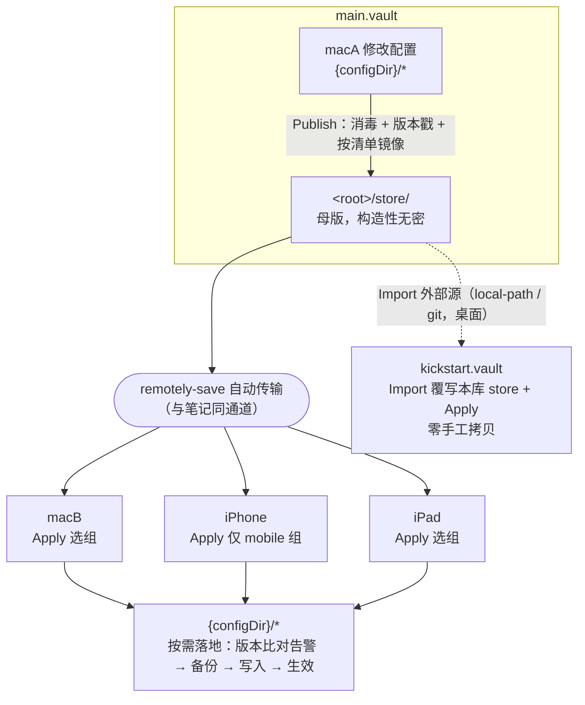

# obsidian-config-sync 设计文档

配置按需分发插件（多设备 + 跨库）。2026-07-08 定稿。

## 1. 背景与问题

- **现状**：配置变更（snippets、hotkeys、插件设置）发生在某台 Mac 的 main.vault 上，需要在每台设备（多 Mac、iPhone、iPad）手工重做，kickstart.vault 还要再来一遍。
- **配置 ≠ 笔记**，不能无脑全量同步：
  1. **设备差异性**——桌面/移动端能力不同，部分配置只适用某类设备；
  2. **敏感性**——部分插件 data.json 含凭据（feishu 四件套、Airtable token），绝不能进 kickstart；
  3. **版本绑定**——插件配置 schema 随插件版本演进，跨版本套用可能不兼容；
  4. **落地特殊**——须写进本设备配置目录（`app.vault.configDir`）并重载生效，remotely-save 默认不碰配置目录。
- **形态**：直接开发为 Obsidian 插件（id：`obsidian-config-sync`），经 BRAT 分发安装。
- **开发位置**：本仓库 `<repo>`，远端 https://github.com/xooooooooox/obsidian-config-sync 。
- **前提**：各设备 configDir 无需同名（动态获取，现场证据：kickstart 的 configDir 实为 `.obsidian_apple`，同目录下 `.obsidian` 为空壳）；main.vault 与 kickstart.vault 是独立 git 仓库（main 有 GitLab 远端）；设备间笔记同步 = remotely-save。

## 2. 核心原理：传输与落地分离

- **传输（自动）**：可共享配置的"母版（store）"存放在库的内容区（root 可配，默认 `config-sync`，kickstart/main 用 `0-Extra/config-sync`）。它们是普通库文件，remotely-save 像同步笔记一样把它们带到所有设备——传输环节零新增设施。
- **落地（按需）**：每台设备显式执行插件的 **Apply** 命令，从 store 选择性地把配置组写入本设备配置目录。选什么组、何时应用，由设备侧决定。

三大风险的对应解法：设备差异性 → 组的 `devices` 标注；敏感性 → Publish 时消毒（store 构造性无密，下游包括 kickstart 天然安全）+ Apply 时保留式合并（见 §4 D1）；版本绑定 → Publish 记录来源插件版本，Apply 比对告警。

### 架构图



### 否决的备选：remotely-save `syncConfigDir`

全自动 + 持续同步，与"按需/设备差异"的核心诉求冲突；标注 experimental；多端同时开启会互相覆盖。不采用。

## 3. store 目录约定

store 结构 = 真实路径的规范化镜像，规范化仅两条机械规则：

1. **configDir 抽象**：配置目录统一存为 `configdir/`，Publish/Apply 时与本设备 `app.vault.configDir` 互映；组 path 中用 `{configDir}` 变量表示。
2. **去前导点**（库根杂项，如 `.obsidian.vimrc` → `obsidian.vimrc`）：因 remotely-save 默认跳过内容区 dot 路径（验证项 0 裁决；若实测可传则此规则作废）。

```
<root>/                                 # 默认 config-sync/,插件设置可改;本库用 0-Extra/config-sync/
├── manifest.json                       # 组定义(用户维护,随 Import 整体覆盖)
├── store.lock.json                     # Publish 生成:各组来源插件版本、发布时间(机器维护)
└── store/
    ├── configdir/                      # ← {configDir}/ 的规范化镜像
    │   ├── snippets/
    │   ├── hotkeys.json
    │   └── plugins/                    #   仅清单内组的 data.json
    │       ├── cmdr/data.json
    │       └── ioto-settings/data.json #   消毒后版本
    └── obsidian.vimrc                  # ← .obsidian.vimrc(库根,去点)
```

### manifest.json（store 根，只含组定义）

```json
{
  "version": 1,
  "groups": [
    { "name": "snippets",             "path": "{configDir}/snippets",                        "type": "dir",  "devices": "all" },
    { "name": "hotkeys",              "path": "{configDir}/hotkeys.json",                    "type": "file", "devices": "all" },
    { "name": "vimrc",                "path": ".obsidian.vimrc",                             "type": "file", "devices": "desktop" },
    { "name": "plugin-cmdr",          "path": "{configDir}/plugins/cmdr/data.json",          "type": "file", "devices": "all" },
    { "name": "plugin-ioto-settings", "path": "{configDir}/plugins/ioto-settings/data.json", "type": "file", "devices": "all",
      "sanitize": ["*ForSync", "*ForFetch", "*APIKey*", "*Token*", "*Secret*", "userEmail"] }
  ]
}
```

组字段：`name`（唯一）、`path`（真实路径，`{configDir}` 变量）、`type`（`file`/`dir`）、`devices`（`all`/`desktop`/`mobile`）、`sanitize`（可选，键名 glob 模式数组，仅对 JSON file 组有效）。

**externalSources 不在 manifest.json 里**。它是每库/每设备私有配置，存于插件自身设置（data.json，不入 store）——否则场景 C 的 Import 用上游 manifest.json 覆写本库时，会把本库配置的外部源清掉。

### store.lock.json（机器维护）

```json
{
  "publishedAt": "2026-07-08T12:00:00Z",
  "groups": {
    "plugin-cmdr": { "sourcePluginVersion": "0.5.2" },
    "plugin-ioto-settings": { "sourcePluginVersion": "2.3.1" }
  }
}
```

仅 `plugins/<id>/…` 组记录版本（读来源库该插件的 manifest.json）。

### 安全黑名单

`remotely-save/`、`ioto-update/`、`slides-rup/`、`obsidian-config-sync/`、`workspace*.json` 永不入 store（机器绑定或含密）。manifest 校验时若组 path 命中黑名单，Publish/Apply 直接报错拒绝，而非静默跳过；黑名单的**祖先目录**（`{configDir}` 本身、`{configDir}/plugins` 整体）同样禁止作为组，防止 dir 组整目录扫入绕过。

## 4. 关键设计决策

| # | 决策 | 内容 | 理由 |
|---|---|---|---|
| — | 插件形态，BRAT 分发 | 独立仓库开发，GitHub Releases（main.js/manifest.json/styles.css）供 BRAT 安装 | 原生命令/ribbon/SettingTab/移动端支持 |
| — | store 进内容区，root 可配 | SettingTab "Data folder" 设置（默认 `config-sync`） | 复用 remotely-save 传输；git 可审计；不绑定 IOTO 布局 |
| — | configDir 动态获取 | `app.vault.configDir` + store 内规范名 `configdir/` | 各设备配置目录无需同名，零硬编码 |
| — | 组（group）为分发单元 | manifest 定义 name/path/type/devices/sanitize | "按需"的粒度载体；设备差异声明一次处处生效 |
| — | 版本绑定处理 | Publish 记录来源插件版本入 store.lock.json；Apply 读目标设备已装版本比对：相同→静默；不同→警告并留给用户确认；未安装→提示装插件 | 记录/比对成本低，把决策留给人 |
| — | 发布侧消毒 | sanitize 键模式剥离 | store 无密是构造性保证 |
| D1 | **Apply 保留式合并** | 带 sanitize 的组落地时：读本地现有 data.json，命中 sanitize 模式的键保留本地值，其余键用 store 版本覆盖；数组按下标递归合并，数组内嵌套的凭据键同样受保护（纯函数 `mergePreservingSanitized(local, incoming, patterns)`） | 凭据各设备录入一次后不被 Apply 抹掉；否则每次 Apply 都要重录，与边界设定矛盾 |
| D2 | **混合生效策略** | 插件 data.json 组：disable → 写入 → re-enable（`app.plugins` 非公开 API，社区通行做法）；core 配置（hotkeys/snippets/vimrc）：写入后报告 Modal 提供一键 Reload app | 运行中插件内存持旧设置，直接写文件会被其后续 `saveData()` 静默回滚；disable/enable 既避免回写又立即生效 |
| D3 | **单份备份 + Revert** | 每次 Apply 前把即将被覆盖的文件备份到 `{configDir}/plugins/obsidian-config-sync/backup/`（只留最近一次，不入 store 不参与同步）；命令 `Revert last apply` 还原 | 移动端无 git 无回滚手段，一次错误 Apply 不可逆；单份备份成本低，覆盖最危险场景 |
| D4 | **externalSources 入插件设置** | 外部源定义存插件自身 data.json（每库独立），manifest.json 只含 groups | Import 覆写 manifest.json 时不摧毁本库的外部源配置 |
| D5 | **git 外部源只读 blob 读取** | 加只读 remote → `git fetch` → `git ls-tree -r` 枚举 `<root>/` 下文件 → 逐个 `git show <remote>/<branch>:<path>` 读内容 → Import 逻辑写入本库 store（顺带 root 重映射） | 不 checkout：工作区与 index 零污染，且不要求两库 root 路径一致 |
| D6 | **移动端 I/O 红线** | `core/` 一切文件读写（store/configDir/备份）只走 `app.vault.adapter`；Node `fs`/`child_process` 只允许出现在 `external/` 模块，`Platform.isDesktop` 门控 | 移动端保留完整 Apply 能力的前提；`isDesktopOnly: false` |
| D7 | **dir 组 = 镜像语义** | Publish 与 Apply 对 `type: "dir"` 组都做含删除传播的完整镜像 | 删除传播（验证项 6）的前提；设备本地私改想保留就不放进组，属"设备个性项"边界 |

## 5. 工作流

### 场景 A：日常配置变更（最高频）
1. macA 正常调整配置；
2. 命令面板/ribbon 执行 **`Config Sync: Publish`** → 消毒 + 版本戳 + 按清单镜像入 store；
3. remotely-save 照常同步 → store 到达所有设备；
4. 需要的设备执行 **`Config Sync: Apply`** → 多选组 → 版本比对告警 → 备份 → 落地（含保留式合并）→ 按 D2 生效。不需要的设备什么都不做——这就是"按需"。

### 场景 B：移动端（iPhone/iPad）
同场景 A 第 4 步；Apply 菜单只列 `all`/`mobile` 组；插件原生跑在移动端，零 shell 依赖（D6）。

### 场景 C：同步到 kickstart（发布前，零手工拷贝）
1. kickstart 里执行 **`Config Sync: Import from external`** → 从插件设置中选外部源（不假定 main.vault 在本机）：
   - `local-path`：本机有 main.vault → Node fs 直读其 `<root>/`；
   - `git`：本机没有 → 按 D5 只读读取 GitLab 远端（桌面门控）；
2. Import 覆写本库 `<root>/`（manifest.json、store.lock.json、store/，含删除传播）→ 接着 Apply 落地；
3. `git diff` 审查（构造性无密）→ 随 vault-backup 提交。

### 场景 D：新设备初始化
装 Obsidian + remotely-save + BRAT 装本插件 → 首次同步拿到 store → Apply 全选 → 重载。

### 边界（不走这套）
- 插件本体安装/卸载：Apply 报告"引用了未安装插件"，人工决定；
- workspace/外观等设备个性项；
- 凭据：各设备手工录入一次（此后受 D1 保护）。

## 6. 插件工程

### 仓库结构

```
obsidian-config-sync/
├── manifest.json                # 插件清单(id: obsidian-config-sync, isDesktopOnly: false)
├── versions.json                # 插件版本 → 最低 Obsidian 版本映射
├── package.json / tsconfig.json / esbuild.config.mjs
├── src/
│   ├── main.ts                  # Plugin 壳:onload 注册命令/ribbon/SettingTab
│   ├── core/                    # 只依赖 app + adapter,可单测
│   │   ├── ConfigSyncCore.ts    # publish/apply/revert/importExternal/版本比对编排
│   │   ├── pathing.ts           # {configDir}↔configdir/ 与去点换算(纯函数)
│   │   ├── sanitize.ts          # 键模式剥离 + mergePreservingSanitized(纯函数)
│   │   └── manifest.ts          # manifest/store.lock 读写与校验(含黑名单)
│   ├── ui/                      # 组多选 Modal、报告 Modal(含 Reload 按钮)、SettingTab
│   └── external/                # local-path(fs)与 git(child_process)源,desktop 门控
├── tests/                       # 纯函数单测(pathing/sanitize/merge/manifest)
├── docs/superpowers/specs/      # 本文档
└── CLAUDE.md                    # 本仓库开发说明
```

### 命令清单

- `Config Sync: Publish` — 本库配置 → store（消毒 + 版本戳 + 镜像）
- `Config Sync: Apply` — store → 本设备配置（选组 + 比对 + 备份 + 合并 + 生效）
- `Config Sync: Revert last apply` — 还原最近一次 Apply 的备份
- `Config Sync: Import from external` — 外部源 → 本库 store（桌面）

### 插件设置（data.json，每设备/每库独立，不入 store）

- `rootPath`：store 根（默认 `config-sync`）；
- `externalSources`：外部源数组，元素为 `{ name, type: "local-path" | "git", path? , remote?, branch?, root }`。

### 错误处理原则

遵循显式失败：store/manifest 缺失或校验不过 → 带原因的明确报错；黑名单命中 → 拒绝并指出组名；git/fs 操作失败 → 透出底层错误信息（命令、退出码、stderr）；不做静默跳过或降级回退。Apply 报告 Modal 汇总每组结果（成功/警告/失败及原因）。

### 开发与发布（对齐官方文档）

- 工程**以官方 `obsidianmd/obsidian-sample-plugin` 仓库为初始点**：工作分支直接根植于模板的 git 历史（remote `template`），`git log` 尾部即工程起点；此后 `git fetch template && git merge template/master` 跟随上游更新（GitHub "Use this template" 是一次性拷贝、无更新通道，故不采用）；TypeScript + esbuild；
- **绝不在 main.vault / kickstart.vault 里调试**——建专用 dev vault，`npm run dev` 持续构建 + hot-reload 插件自动重载；两个真实库只在验证阶段以 BRAT/手动安装测试版；
- manifest 约定：插件目录名 = id；修改 manifest.json 需重启 Obsidian；
- 发布链：GitHub Releases 挂 main.js/manifest.json/styles.css，versions.json 维护版本映射 → 各设备 BRAT 以 `xooooooooox/obsidian-config-sync` 安装/更新。

### 测试策略

- `tests/`：纯函数单测（pathing 双向换算、sanitize 剥离与 mergePreservingSanitized 对偶性、manifest 校验含黑名单）；
- 集成验证走 §7 验收清单，在真实库/设备上手工执行——本插件的核心风险在真实环境行为（remotely-save、移动端、git），不做 mock 集成测试。

## 7. 验收清单

0. **前置**：remotely-save 对内容区 dot 路径的行为——`store/.probe/x.md` vs `store/probe/x.md` 同步实验，裁决"去点"规则去留；
1. **消毒**：main 侧 Publish 后对 `<root>/store/` grep 凭据特征 → 零命中；
2. **按需落地**：macB Apply 仅选 2 组 → 只这 2 组变化，生效；
3. **版本比对**：store.lock 记录的插件版本与目标设备不一致时，Apply 给出明确警告；
4. **移动端**：iPhone Apply 菜单只含 all/mobile 组，应用 snippets 成功；
5. **kickstart**：Import（先 local-path 后 git 两通道）→ Apply → ribbon/样式正常，`git diff` 无敏感内容；
6. **删除传播**：main 删一个 snippet → Publish → 设备 Apply 后本地同步消失；
7. **保留式合并**：macB 已录 ioto-settings 凭据 → Apply 该组 → 非敏感配置更新且凭据完好；
8. **回滚**：Apply 后执行 Revert last apply → 配置还原到 Apply 前状态。
